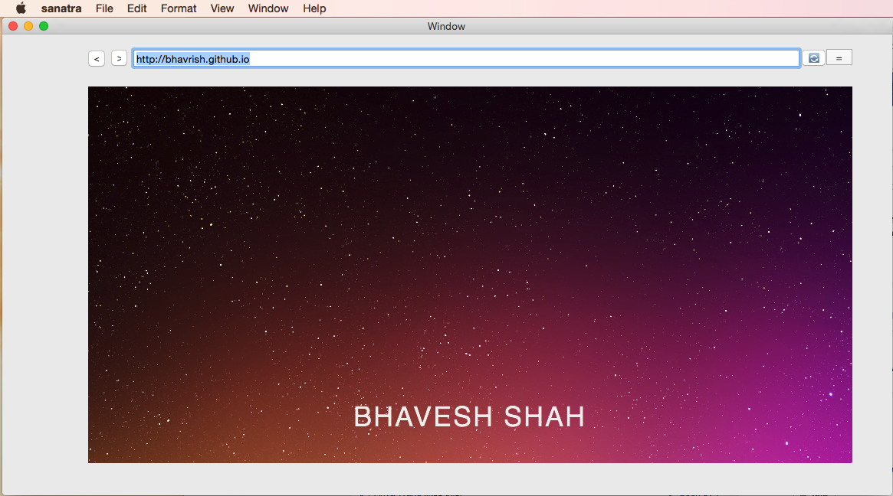
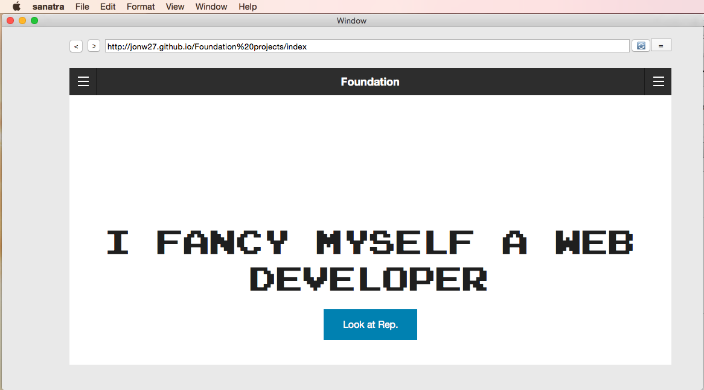
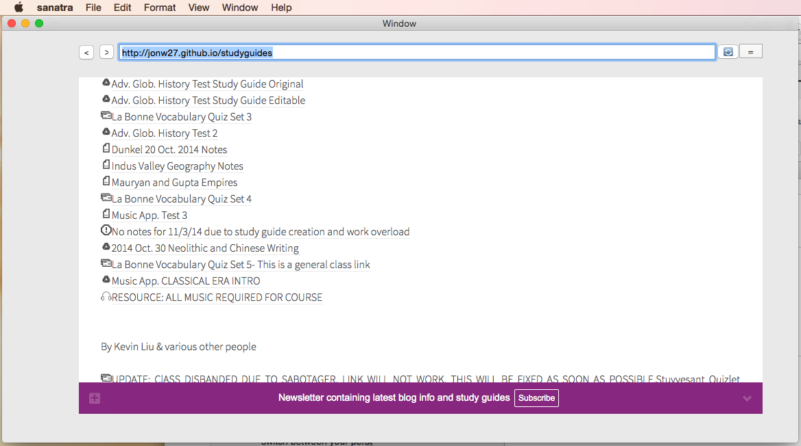
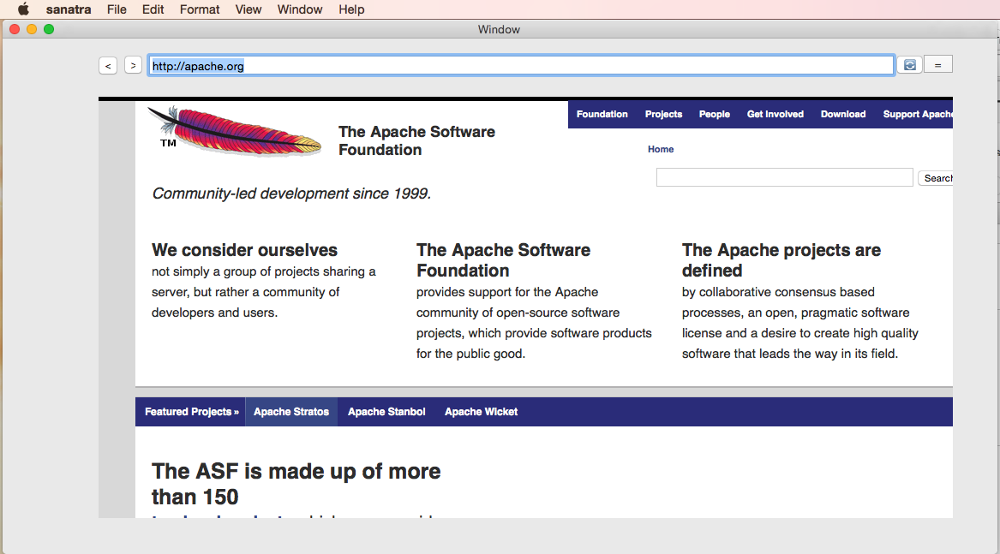

# sanatra
Small prototype web browser based on webkit framework and created with cocoa interface builder

This is sanatra.
It is a prototype really basic web browser. Hope to update it in the future. 

KNOWN BUGS
 
*When scrolling it lags, specially caused with parallax effects.
*No support for Adobe flash unless Adobe Flash Player is already installed
*When a link is clicked the url field doesnt change
*Downloads don't work
*Possible Security Vulnerabilities– reason why this is not publicly avaible on the net as of yet

<h2>Screenshots</h2>
 

<h2>Version</h2>
This is version 1.0
-basic web browser
-reload button
-back button
-forward button
-print command function
-text enlargement available from top menu
